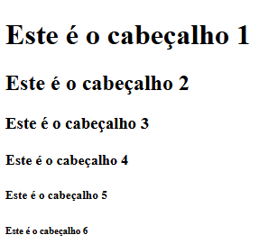
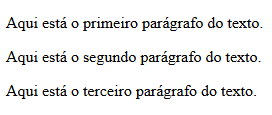
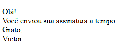
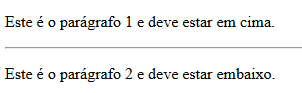
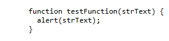
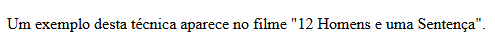

## Tags de Cabeçalho

Qualquer documento começa com um título. Você pode usar tamanhos diferentes para seus títulos. O HTML tem seis níveis de cabeçalhos, que usam os elementos `<h1>`, `<h2>`, `<h3>`, `<h4>`, `<h5>` e `<h6>` . Ao exibir qualquer título, o navegador adiciona uma quebra de linha antes e depois desse título.

Exemplo:
```html
<html>

  <head>
    <title>Heading Example</title>
  </head>

  <body>
    <h1>Este é o cabeçalho 1</h1>
    <h2>Este é o cabeçalho 2</h2>
    <h3>Este é o cabeçalho 3</h3>
    <h4>Este é o cabeçalho 4</h4>
    <h5>Este é o cabeçalho 5</h5>
    <h6>Este é o cabeçalho 6</h6>
  </body>

</html>
```
Resultado:


## Tag de parágrafo

A tag `<p>` oferece uma maneira de estruturar seu texto em diferentes parágrafos. Cada parágrafo de texto deve ficar entre uma tag de abertura `<p>` e uma tag de fechamento `</p>`, conforme mostrado abaixo no exemplo:

```html
<html>

  <head>
    <title>Exemplo de parágrafos</title>
  </head>

  <body>
    <p>Aqui está o primeiro parágrafo do texto.</p>
    <p>Aqui está o segundo parágrafo do texto.</p>
    <p>Aqui está o terceiro parágrafo do texto.</p>
  </body>

</html>
```
Resultado:


## Tag de quebra de linha

Sempre que você usa o elemento `<br />`, tudo o que o segue começa na próxima linha. Esta tag é um exemplo de um elemento vazio, onde você não precisa abrir e fechar a tag, pois não há nada entre elas.

A tag `<br />` possui um espaço entre os caracteres br e a barra. Se você omitir este espaço, os navegadores mais antigos terão problemas para processar a quebra de linha. Por outro lado, se você omitir o caractere de barra e usar apenas `<br>`, seu HTML não será um XHTML válido.

```html
<html>

  <head>
    <title>Exemplo de quebra de linha</title>
  </head>

  <body>
    <p>
      Olá!<br />
      Você enviou sua assinatura a tempo.<br />
      Grato,<br />
      Victor
    </p>
  </body>

</html>
```
Resultado:


## Conteúdo centralizado

Você pode usar a tag `<center>` para colocar qualquer conteúdo no centro da página ou no centro da célula de uma tabela.

```html
<html>

  <head>
    <title>Exemplo de conteúdo centralizado</title>
  </head>

  <body>
    <p>Este texto não está centroalizado.</p>

    <center>
      <p>Este texto está centralizado.</p>
    </center>
  </body>

</html>
```
Resultado:


## Linhas horizontais

As linhas horizontais são usadas para separar visualmente as seções de um documento. A tag `<hr>` cria uma linha na ponto atual do documento até a margem direita e insere uma quebra de linha em seguida.

Por exemplo, você pode querer apresentar uma linha entre dois parágrafos como no exemplo abaixo:

```html
<html>

  <head>
    <title>Exemplo de linha horizontal</title>
  </head>

  <body>
    <p>Este é o parágrafo 1 e deve estar em cima.</p>
    <hr />
    <p>Este é o parágrafo 2 e deve estar embaixo.</p>
  </body>

</html>
```
Resultado:


Novamente a tag `<hr />` é um exemplo de elemento vazio, onde você não precisa abrir e fechar as tags, pois não há nada entre elas.

## Preservar a formatação

Às vezes, você deseja que o seu texto siga o formato exato em que está escrito no documento HTML. Nesses casos, você pode usar a tag pré-formatada `<pre>`.

Qualquer texto entre a tag de abertura `<pre>` e a tag de fechamento `</pre>` preservará a formatação do documento de origem.

```html
<html>

  <head>
    <title>Exemplo de perservação da formatação</title>
  </head>

  <body>
    <pre>
      function testFunction(strText) {
        alert(strText);
      }
    </pre>
  </body>

</html>
```
Resultado:


Tente usar o mesmo código sem mantê-lo dentro das tags `<pre>`...`</pre>`

## Espaços não separáveis

Suponha que você queira usar a frase "12 Homens e uma Sentença". Aqui, você não gostaria que um navegador dividisse "12 Homens e uma" e "Sentença" em duas linhas.

`Um exemplo desta técnica aparece no filme "12 Homens e uma Sentença."`

Nos casos em que você não deseja que o navegador quebre o texto, você deve usar uma entidade de espaço não separável `&nbsp;` em vez de um espaço normal. Por exemplo, ao codificar os "12 Homens e uma Sentença" em um parágrafo, você deve usar algo semelhante ao seguinte código:

```html
<html>

  <head>
    <title>Exemplo de espaços não separáveis</title>
  </head>

  <body>
    <p>Um exemplo desta técnica aparece no filme "12&nbsp;Homens&nbsp;e&nbsp;uma&nbsp;Sentença".</p>
  </body>

</html>
```
Resultado:
