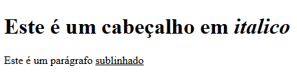

Um elemento HTML é definido por uma tag inicial. Se o elemento contiver outro conteúdo, ele termina com uma tag de fechamento, onde o nome do elemento é precedido por uma barra, conforme mostrado abaixo com algumas tags:

| Tag de abertura | Conteúdo                        | Tag de fechamento |
| --------------- | ------------------------------- | ----------------- |
| `<p>`           | Este é o conteúdo do parágrafo. | `</p>`            |
| `<h1>`          | Este é o conteúdo do título.    | `</h1>`           |
| `<div>`         | Este é o conteúdo da divisão.   | `</div>`          |
| `<br />`        |                                 |                   |

Portanto, aqui `<p>`...`</p>` é um elemento HTML e `<h1>`...`</h1>` é outro elemento HTML. Existem alguns elementos HTML que não precisam ser fechados, como os elementos ``, `<hr />` e `<br />`. Eles são conhecidos como **elementos vazios**.

Os documentos HTML consistem em uma _árvore_ desses elementos e eles especificam como os documentos devem ser construídos e que tipo de conteúdo deve ser colocado em que parte no momento da renderização.

## Tag HTML vs. Elemento

Um elemento HTML é definido por uma _tag de abertura_. Se o elemento contiver outro conteúdo, ele termina com uma _tag de fechamento_.

Por exemplo, `<p>` é a tag de abertura de um parágrafo e `</p>` é a tag de fechamento do mesmo parágrafo. Damos o nome de _Elemento_ ao conjunto completo: `<p>Este é o parágrafo</p>` é um exemplo de elemento de parágrafo.

## Elementos HTML aninhados

É permitido inserir um elemento HTML dentro de outro. Por exemplo:

```html
<html>

  <head>
    <title>Exemplo de elementos HTML aninhados</title>
  </head>

  <body>
    <h1>Este é um cabeçalho em <i>italico</i></h1>
    <p>Este é um parágrafo <u>sublinhado</u></p>
  </body>

</html>
```
Resultado:
